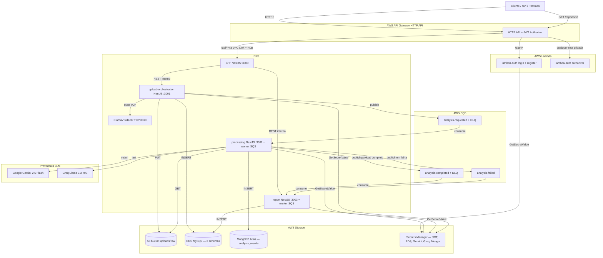
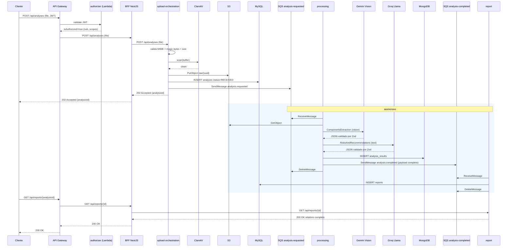
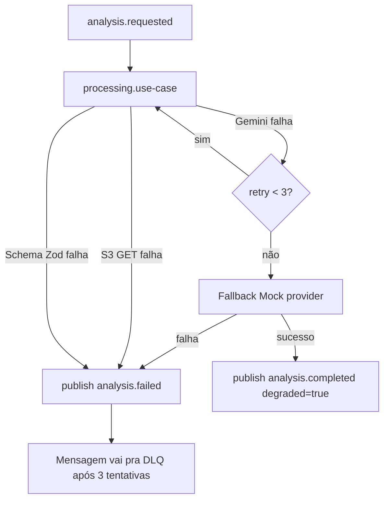

# Diagrama de arquitetura

## Visão de alto nível (C4 — Container)

## Sequência do happy path

## Fluxo de falha permanente

## Bounded contexts e ownership de dados

| Bounded context | Owner | DB | Lê de | Escreve em |
|---|---|---|---|---|
| Upload | `upload-orchestration` | MySQL `fiap_hackathon_upload` | — | S3, MySQL, SQS analysis-requested |
| Processing | `processing` | MongoDB `fiap_hackathon_processing` | S3, SQS analysis-requested | MongoDB, SQS analysis-completed/failed |
| Reporting | `report` | MySQL `fiap_hackathon_report` | SQS analysis-completed/failed | MySQL |
| Auth | `lambda-auth` | MySQL `fiap_hackathon_auth` | — | MySQL |
| Edge | `bff` | sem persistência | — | — |

Princípio: **cada serviço dono de seu DB**. Nenhum serviço lê o banco do outro. A integração entre `processing` e `report` é via Event-Carried State Transfer no SQS (payload completo no `analysis.completed`).
