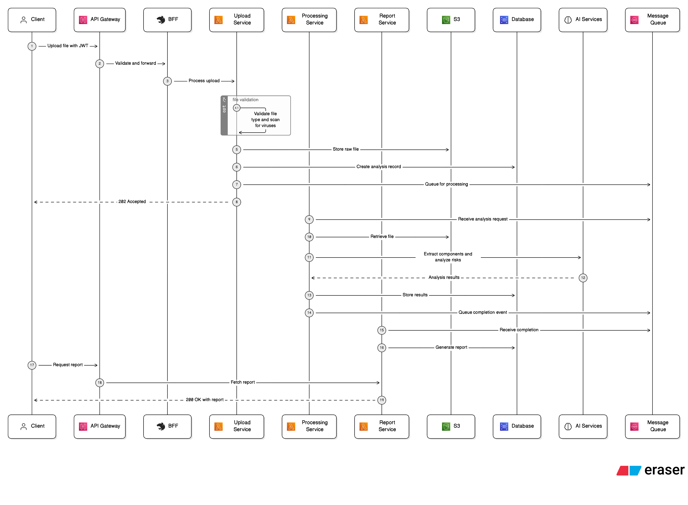
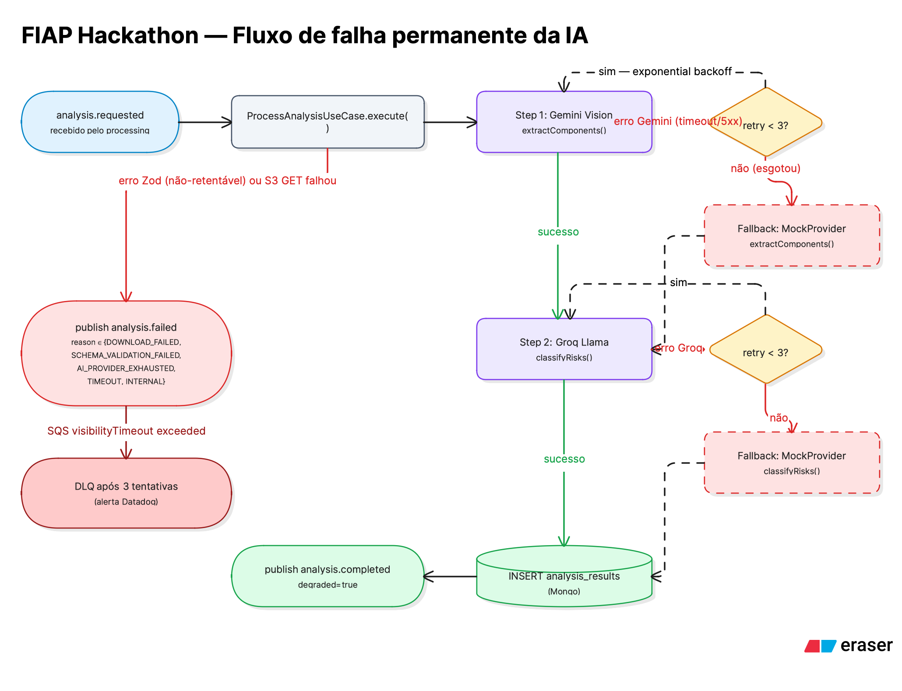

# Diagramas de arquitetura

Diagramas gerados em [Eraser.io](https://app.eraser.io) e exportados como PNG. Os fontes (DSL do Eraser) ficam em [`diagrams/sources/`](diagrams/sources/) para facilitar manutenção.

---

## 1. Visão de containers (C4 Container)

Visão de alto nível mostrando cliente, edge (API Gateway + Lambdas de auth), os 4 microsserviços NestJS rodando no EKS, storage (S3, RDS, MongoDB Atlas), mensageria (3 filas SQS), Secrets Manager, provedores LLM externos (Gemini Vision e Groq Llama 3.3) e a camada de observabilidade Datadog.

**Pontos a destacar nesta visão:**

- O cliente fala apenas com o **API Gateway HTTP API**, que aplica TLS, CORS e rate limit antes de qualquer coisa.
- O **Lambda Authorizer** valida o JWT HS256 em todas as rotas privadas; rotas `/auth/*` (login e register) entram em Lambdas dedicadas.
- O tráfego do API Gateway para o cluster EKS passa por um **VPC Link + NLB interno** — nenhum microsserviço fica exposto publicamente.
- Cada serviço NestJS tem seu **DB próprio** (princípio de bounded context): `upload-orchestration` e `report` em MySQL via Prisma; `processing` em MongoDB Atlas via Mongoose.
- O `processing` é o único serviço que fala com os **provedores LLM externos** — os outros não conhecem nada sobre IA.
- Todos os pods consomem credenciais via **AWS Secrets Manager + IRSA** (uma role por serviço, com privilégio mínimo definido em `terraform/iam.tf`).

---

## 2. Sequência do happy path

Passo a passo do fluxo síncrono + assíncrono, do `POST /api/analyses` do cliente até o `GET /api/reports/{id}` retornando o relatório completo.

**Pontos a destacar:**

- Os passos **1-8** rodam síncronos: cliente recebe `202 Accepted` em segundos com o `analysisId`. O upload é validado (MIME + magic bytes + tamanho), passa pelo ClamAV, é gravado no S3 e a mensagem `analysis.requested` vai pra fila.
- Os passos **9-14** rodam **assíncronos**: o `processing` consome a fila, baixa o arquivo do S3, executa o pipeline IA em duas etapas, persiste o resultado no Mongo e publica `analysis.completed` com o payload completo (Event-Carried State Transfer).
- Os passos **15-16** são o `report` consumindo o evento e materializando uma cópia local em MySQL — fica autossuficiente para responder consultas sem chamar nenhum outro serviço.
- Os passos **17-19** são consulta do cliente: `GET /api/reports/:id` passa pelo BFF e devolve o relatório completo.

---

## 3. Fluxo de falha permanente da IA

Como o sistema reage quando algum passo do pipeline IA falha de forma permanente: retry exponencial, fallback para Mock provider, e classificação de falha quando nem o Mock resolve.

**Pontos a destacar:**

- Cada chamada a Gemini ou Groq tem **retry 3x com exponential backoff**.
- Se mesmo após retries o provider externo falhar, o sistema cai automaticamente para o **MockLlmProvider** (saída determinística) — o evento `analysis.completed` ainda é publicado, mas com `degraded: true` para sinalizar ao consumidor que precisa de revisão humana.
- Falhas **não-retentáveis** (Zod schema validation falhou, S3 GET falhou) vão direto para `analysis.failed`, com `reason` explícito.
- Após 3 tentativas no SQS, a mensagem vai para a **DLQ** e dispara alerta no Datadog.

---

## Bounded contexts e ownership de dados

| Bounded context | Owner | DB | Lê de | Escreve em |
|---|---|---|---|---|
| Upload | `upload-orchestration` | MySQL `fiap_hackathon_upload` | — | S3, MySQL, SQS analysis-requested |
| Processing | `processing` | MongoDB `fiap_hackathon_processing` | S3, SQS analysis-requested | MongoDB, SQS analysis-completed/failed |
| Reporting | `report` | MySQL `fiap_hackathon_report` | SQS analysis-completed/failed | MySQL |
| Auth | `lambda-auth` | MySQL `fiap_hackathon_auth` | — | MySQL |
| Edge | `bff` | sem persistência | — | — |

**Princípio inviolável**: cada serviço dono do seu DB. Nenhum serviço lê o banco do outro. A integração entre `processing` e `report` é via Event-Carried State Transfer no SQS (payload completo no `analysis.completed`).
